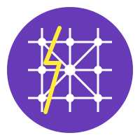

# FuryMesh

<div align="center">
  
</div>

FuryMesh is a peer-to-peer file sharing system built on WebRTC technology, enabling direct browser-to-browser communication for efficient and decentralized file transfers.

## Overview

FuryMesh leverages WebRTC data channels to create a mesh network of peers that can share files directly without requiring centralized servers for data transfer. The system uses FlatBuffers for efficient binary serialization of messages between peers.

## Features

| Category | Feature | Description |
|----------|---------|-------------|
| **Core Technology** | WebRTC-based P2P Communication | Direct peer-to-peer connections for efficient data transfer |
| | Decentralized Architecture | No central server required for file transfers |
| | FlatBuffers Serialization | Efficient binary protocol for message exchange |
| **Security** | End-to-End Encryption | Secure file transfers with RSA key exchange and AES-256 encryption |
| | Integrity Verification | SHA-256 hashing for chunk and file verification |
| **Networking** | DHT-based Peer Discovery | Kademlia distributed hash table for efficient peer discovery |
| | WebRTC Integration | Seamless peer discovery and connection management |
| **File Management** | Enterprise-Grade File Transfer | Robust file chunking, transfer, and reassembly |
| | Persistent Storage | Reliable storage of file chunks and metadata |
| | Transfer Management | Advanced transfer tracking with statistics and retry mechanisms |
| **User Interface** | CLI Interface | Easy-to-use command line interface for managing nodes and transfers |
| | Monitoring API | HTTP API for monitoring node status and network health |

## Components

### Core Components

- **Node**: Manages WebRTC connections and data channels for P2P communication
- **Server**: Provides HTTP API endpoints for monitoring and management
- **FlatBuffers Schema**: Defines the message format for peer communication
- **File Transfer System**: Handles chunking, transfer, and reassembly of files

### File Transfer Components

- **Chunker**: Splits files into chunks and reassembles them with integrity verification
- **TransferManager**: Manages file transfers between peers with retry logic and statistics
- **StorageManager**: Handles persistent storage of file chunks and metadata
- **WebRTCTransport**: Integrates with WebRTC for peer-to-peer data transfer

### Directory Structure

- `/cmd`: CLI command definitions using Cobra
- `/fury`: Generated FlatBuffers code for message serialization
- `/node`: WebRTC node implementation
- `/server`: HTTP API server implementation
- `/file`: File transfer system implementation
- `schema.fbs`: FlatBuffers schema definition

## Getting Started

### Prerequisites

- Go 1.24 or later
- FlatBuffers compiler (for schema changes)

### Installation

```bash
# Clone the repository
git clone https://github.com/TFMV/furymesh.git
cd furymesh

# Build the project
go build -o furyctl
```

### Configuration

FuryMesh uses a YAML configuration file (`config.yaml`) with the following structure:

```yaml
webrtc:
  stun_servers:
    - "stun:stun.l.google.com:19302"
    - "stun:stun1.l.google.com:19302"

compression:
  enabled: true
  algorithm: "zstd"

logging:
  level: "info"

api:
  port: 8080

storage:
  work_dir: "~/.furymesh/work"
  base_dir: "~/.furymesh"
  
# DHT configuration
dht:
  enabled: true
  address: "0.0.0.0"
  port: 8000
  bootstrap_nodes:
    - "bootstrap1.furymesh.example:8000"
    - "bootstrap2.furymesh.example:8000"

# Encryption configuration
encryption:
  enabled: true
  keys_dir: "~/.furymesh/keys"
  key_size: 2048
  session_key_size: 256
  cipher_mode: "GCM"
```

### Usage

#### Starting a Node

```bash
./furyctl node start
```

#### Starting the API Server

```bash
./furyctl server start
```

#### Checking Node Status

```bash
curl http://localhost:8080/status
```

#### File Operations

Chunk a file for sharing:

```bash
./furyctl file chunk path/to/file.txt
```

List available files:

```bash
./furyctl file list
```

Reassemble a file from chunks:

```bash
./furyctl file reassemble <file_id> --output path/to/output.txt
```

Delete a file:

```bash
./furyctl file delete <file_id>
```

Clean up expired files:

```bash
./furyctl file cleanup --max-age 30d
```

## File Transfer Architecture

FuryMesh implements an enterprise-grade file transfer system with the following features:

### Chunking and Reassembly

- Files are split into configurable-sized chunks (default 1MB)
- Each chunk is hashed using SHA-256 for integrity verification
- Chunks are stored with metadata for efficient retrieval
- Files are reassembled with integrity checks at both chunk and file levels

### Transfer Management

- Concurrent transfers with configurable limits
- Automatic retries with exponential backoff
- Detailed transfer statistics and progress tracking
- Graceful handling of connection interruptions

### Storage

- Persistent storage of file chunks and metadata
- Efficient caching for improved performance
- Automatic cleanup of expired files
- Detailed storage statistics

### WebRTC Integration

- Direct peer-to-peer data transfer
- Automatic peer discovery and connection management
- Efficient binary serialization using FlatBuffers
- Robust error handling and connection recovery

## Node Integration

The file transfer system is fully integrated with the FuryMesh node, allowing for seamless file sharing between peers in the network. The integration includes:

1. **Automatic File Discovery**: When peers connect, they automatically share information about available files.
2. **WebRTC-based Transfer**: Files are transferred directly between peers using WebRTC data channels.
3. **Persistent Storage**: Files are stored persistently and can be accessed even after restarts.
4. **Configuration**: All file transfer settings can be configured in the `config.yaml` file.

### Using File Transfer in a Node

When running a FuryMesh node, the file transfer system is automatically initialized and started. You can interact with it using the CLI commands:

```bash
# Start a node
furymesh node

# In another terminal, chunk a file
furymesh file chunk /path/to/file.txt

# List available files
furymesh file list

# Request a file from a peer
furymesh file request <peer-id> <file-id>

# Check transfer status
furymesh file status <file-id>
```

### Node Architecture

The node integration uses the following components:

1. **FileManager**: Manages file operations and integrates with the node.
2. **Node**: Represents a FuryMesh P2P node with file transfer capabilities.
3. **WebRTCTransport**: Handles WebRTC connections for file transfers.
4. **TransferManager**: Manages file transfers between peers.
5. **StorageManager**: Handles persistent storage of files and metadata.

## Development

### Modifying the FlatBuffers Schema

1. Edit the `schema.fbs` file
2. Regenerate the Go code:

```bash
flatc --go schema.fbs
```

### Adding New Commands

1. Create a new file in the `/cmd` directory
2. Define your command using Cobra
3. Add it as a subcommand to the root command in `cmd/root.go`

## Areas for Improvement

1. **Peer Discovery**: Implement a discovery mechanism for peers to find each other
2. **Authentication**: Add authentication for secure peer connections
3. **File Integrity**: Implement checksums for file integrity verification
4. **UI**: Develop a web-based user interface for easier management
5. **Testing**: Add comprehensive unit and integration tests

## License

This project is licensed under the terms of the LICENSE file included in the repository.

## Security Features

### End-to-End Encryption

FuryMesh implements robust end-to-end encryption to ensure that all file transfers are secure:

1. **Key Management**:
   - RSA key pairs (2048-bit by default) are generated for each node
   - Keys are stored securely with appropriate file permissions
   - Public keys are exchanged during peer connection

2. **Session Keys**:
   - Unique AES-256 session keys are generated for each file transfer
   - Session keys are exchanged securely using RSA encryption
   - Session keys are used to encrypt/decrypt file chunks

3. **Encryption Process**:
   - File chunks are encrypted using AES-256-GCM
   - Each chunk includes authentication data to prevent tampering
   - Encrypted chunks are transmitted over secure WebRTC data channels

4. **Configuration**:
   - Encryption settings can be customized in the `config.yaml` file
   - Options include key size, session key size, and cipher mode

### Peer Discovery

FuryMesh uses a Kademlia Distributed Hash Table (DHT) for decentralized peer discovery:

1. **DHT Structure**:
   - Nodes are organized in a binary tree structure
   - Each node maintains a routing table of known peers
   - Node IDs are generated using SHA-256 hashes

2. **Node Lookup**:
   - Efficient O(log n) lookup algorithm
   - Concurrent node queries for faster discovery
   - Automatic routing table maintenance

3. **File Announcements**:
   - Files are announced to the DHT with metadata
   - File lookups use the same efficient algorithm
   - Periodic republishing ensures availability

4. **Bootstrap Process**:
   - New nodes connect to bootstrap nodes to join the network
   - Bootstrap nodes are configurable in the `config.yaml` file
   - The system can operate without bootstrap nodes once connected

5. **Configuration**:
   - DHT settings can be customized in the `config.yaml` file
   - Options include refresh intervals, replication intervals, and bootstrap nodes
